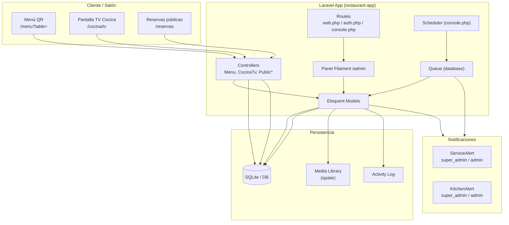
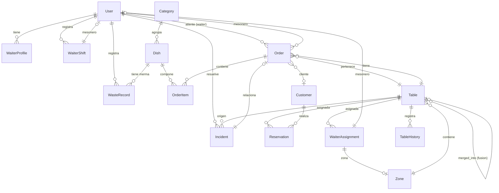
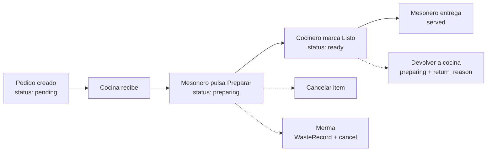
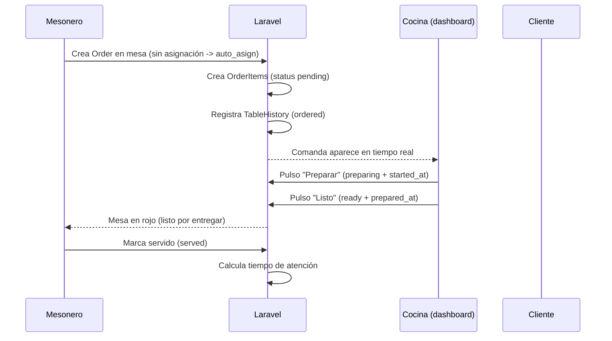
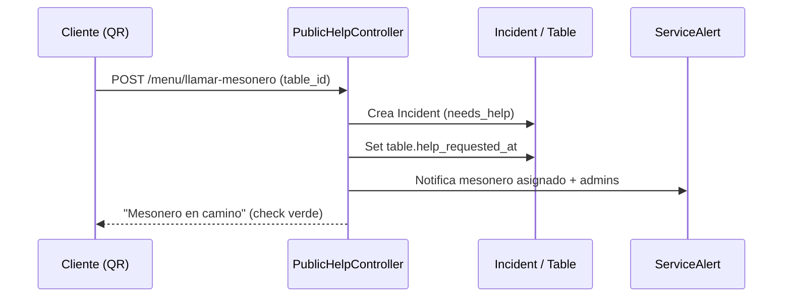
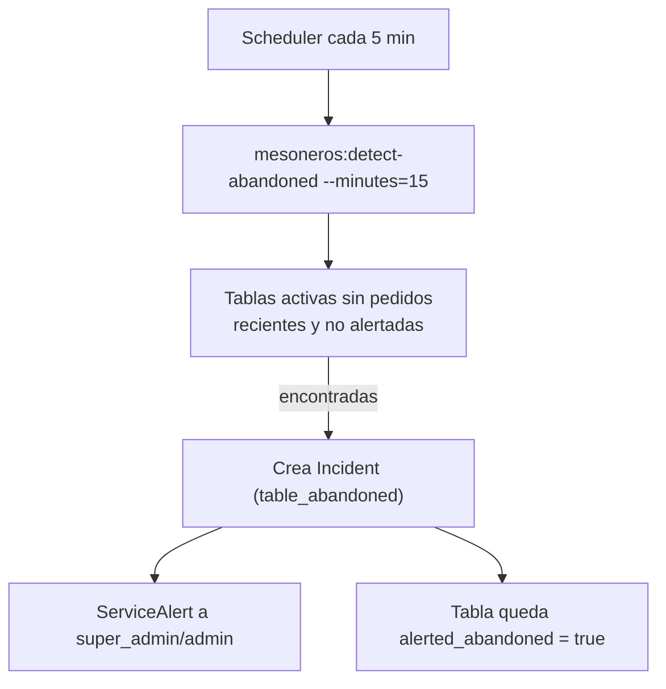
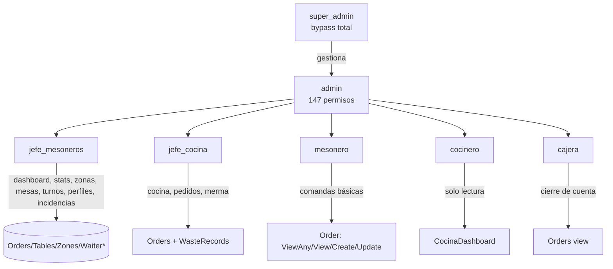
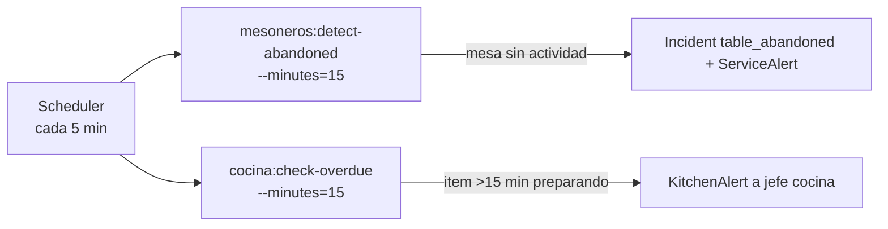

# 🍽️ Restaurant SaaS — Sistema de Gestión para Restaurantes

Plataforma SaaS de gestión de restaurantes construida con **Laravel 13 + Filament v5**. Cubre el ciclo completo de operación: menú digital, reservas, comandas de mesoneros, cocina en tiempo real, mermas, turnos e incidencias, todo respaldado por roles granulares (Filament Shield) y auditoría.

---

## 📚 Tabla de contenidos

- [Stack tecnológico](#stack-tecnológico)
- [Arquitectura general](#arquitectura-general)
- [Requisitos](#requisitos)
- [Instalación](#instalación)
- [Configuración del entorno](#configuración-del-entorno)
- [Comandos útiles](#comandos-útiles)
- [Estructura del proyecto](#estructura-del-proyecto)
- [Modelo de datos (diagrama ER)](#modelo-de-datos-diagrama-er)
- [Módulos operativos](#módulos-operativos)
  - [Mesoneros](#módulo-de-mesoneros)
  - [Cocina](#módulo-de-cocina)
- [Flujos principales (diagramas)](#flujos-principales-diagramas)
- [Roles y permisos](#roles-y-permisos)
- [Rutas públicas](#rutas-públicas)
- [Tareas programadas](#tareas-programadas)
- [Pruebas](#pruebas)
- [Estado de implementación](#estado-de-implementación)

---

## Stack tecnológico

| Capa | Tecnología |
|---|---|
| **Backend** | Laravel 13 (PHP 8.3+) |
| **Panel admin** | Filament v5 |
| **UI / frontend** | Tailwind CSS 3, Alpine.js, Blade, Vite |
| **Auth** | Laravel Breeze |
| **RBAC** | `spatie/laravel-permission` + `bezhansalleh/filament-shield` |
| **Medios** | `spatie/laravel-medialibrary` |
| **Auditoría** | `spatie/laravel-activitylog` + `pxlrbt/filament-activity-log` |
| **Base de datos** | SQLite (desarrollo/pruebas), adaptable a MySQL/PostgreSQL |
| **Cola / jobs** | Laravel Queue (driver `database`) |
| **Logs** | Laravel Pail |

> ⚠️ **Multi-tenant / Facturación (Cashier):** Especificados en `inicial.md` y `avanzado.md` como roadmap, **aún no implementados**. Actualmente no hay aislamiento por tenant instalado (`filament-shield.php` ⇒ `tenant_model => null`).

---

## Arquitectura general



---

## Requisitos

- **PHP** >= 8.3
- **Composer** >= 2.x
- **Node.js** >= 18 y **npm**
- **SQLite** (incluido) — o MySQL/PostgreSQL configurado en `.env`
- Extensiones PHP: `pdo_sqlite`, `mbstring`, `openssl`, `tokenizer`, `xml`, `ctype`, `json`, `bcmath`

---

## Instalación

> Todos los comandos se ejecutan desde la carpeta `restaurant-app/`.

### 1. Clonar y entrar al proyecto

```bash
git clone <repo> restaurant
cd restaurant/restaurant-app
```

### 2. Instalar dependencias de PHP

```bash
composer install
```

### 3. Instalar dependencias de frontend

```bash
npm install --ignore-scripts
```

> ⚠️ El repo incluye `.npmrc` con `ignore-scripts=true`. Los scripts postinstall de npm **no** se ejecutan; por eso usamos `--ignore-scripts` explícitamente. Luego compilamos con `npm run build`.

### 4. Configurar entorno

```bash
cp .env.example .env
php artisan key:generate
```

Edita `.env` si usas MySQL/PostgreSQL (ver [Configuración del entorno](#configuración-del-entorno)).

### 5. Migrar base de datos

```bash
touch database/database.sqlite   # si usas SQLite
php artisan migrate --force
```

### 6. Compilar assets

```bash
npm run build      # producción
# o
npm run dev        # desarrollo con watch
```

### 7. Generar permisos (Shield)

Después de crear/modificar recursos de Filament:

```bash
php artisan shield:generate --all
```

### 8. (Opcional) Servidor de desarrollo

```bash
composer dev
```

Este meta-comando levanta en paralelo: `php artisan serve`, `queue:listen`, `pail` (logs) y `npm run dev` con `concurrently`. Si uno cae, se matan todos.

### Instalación rápida con script

El `composer.json` define un script `setup` que automatiza los pasos 2→6:

```bash
composer setup
```

> `composer setup` hace: `composer install` → copia `.env` → `key:generate` → `migrate` → `npm install --ignore-scripts` → `npm run build`.

---

## Configuración del entorno

Variables relevantes en `.env`:

```dotenv
APP_NAME="Restaurant SaaS"
APP_URL=http://localhost:8000

DB_CONNECTION=sqlite
# DB_CONNECTION=mysql
# DB_HOST=127.0.0.1
# DB_PORT=3306
# DB_DATABASE=restaurant
# DB_USERNAME=root
# DB_PASSWORD=

QUEUE_CONNECTION=database   # no usar sync fuera de tests
SESSION_DRIVER=database
CACHE_STORE=database
```

Quirks por defecto del entorno:

- **DB**: SQLite (`database/database.sqlite`); tests usan `:memory:`.
- **Queue**: driver `database` (no `sync`, excepto en tests donde se fuerza `sync`).
- **Session / Cache**: drivers `database`.

---

## Comandos útiles

| Comando | Descripción |
|---|---|
| `composer setup` | Instalación completa automatizada |
| `composer dev` | Servidores de desarrollo en paralelo |
| `composer test` | Limpia config y corre `php artisan test` |
| `php artisan pint` | Formatea código (Laravel Pint) |
| `npm run build` / `npm run dev` | Build / watch de Vite |
| `php artisan shield:generate --all` | Regenera permisos de Shield |
| `php artisan mesoneros:detect-abandoned --minutes=15` | Detecta mesas inactivas |
| `php artisan cocina:check-overdue --minutes=15` | Detecta items en demora en cocina |
| `php artisan schedule:list` | Lista tareas programadas |
| `php artisan schedule:work` | Ejecuta el scheduler en local |
| `php artisan queue:listen` | Procesa la cola (driver database) |
| `php artisan pail` | Logs en tiempo real |

---

## Estructura del proyecto

```
restaurant-app/
├── app/
│   ├── Console/Commands/      # DetectAbandonedTables, CheckOverdueItems
│   ├── Filament/
│   │   ├── Pages/             # MesonerosDashboard, CocinaDashboard,
│   │   │                      #   EstadisticasSemanales, CajeraDashboard
│   │   └── Resources/         # CRUD de cada entidad (Dishes, Tables, Orders…)
│   │       └── {Entity}/{Entity}Resource.php
│   │           ├── Pages/  Schemas/  Tables/
│   ├── Http/Controllers/      # Menu, CocinaTv, PublicHelp, PublicReservation, Profile
│   ├── Models/                # 15 modelos Eloquent
│   ├── Notifications/         # ServiceAlert, KitchenAlert
│   ├── Observers/  Policies/  Providers/
├── database/migrations/       # 14+ migraciones con timestamps de cocina
├── routes/                    # web.php, auth.php, console.php
├── resources/                 # Blade + assets (Tailwind/Alpine/Vite)
├── tests/                     # Feature (Auth, Mesoneros, Cocina) + Unit
└── phpunit.xml
```

Convenciones:

- Recursos Filament organizados como `Resources/{Entity}/{Entity}Resource.php` con subdirectorios `Pages/`, `Schemas/`, `Tables/`.
- Navegación de Mesoneros usa `navigationGroup = 'Mesoneros'` con tipado `string|UnitEnum|null`.
- Estilos: Pint (4 espacios, UTF-8, LF). Colores Tailwind custom: `espresso`, `cream`, `gold`, `sienna`.

---

## Modelo de datos (diagrama ER)



### Resumen de modelos

| Modelo | Relaciones clave | Notas |
|---|---|---|
| `User` | HasRoles (Spatie) | Mesonero/admin; relaciones como `waiter` |
| `Category` | hasMany Dish | HasMedia (iconos/imágenes) |
| `Dish` | belongsTo Category | HasMedia (foto del plato) |
| `Table` | belongsTo Zone; merged_into | `zone_id`, `merged_into_id`, `help_requested_at` |
| `Customer` | hasMany Reservation | Historial de cliente |
| `Reservation` | belongsTo Customer/Table | Estado, guest_count, reservation_date |
| `Zone` | hasMany Table | Terraza, VIP, Barra… |
| `Order` | belongsTo Table/Waiter/Customer; hasMany OrderItems | status, priority, notes, `internal_note`, payment |
| `OrderItem` | belongsTo Order/Dish | Cantidad, modifiers, status, timestamps cocina |
| `WaiterAssignment` | belongsTo Table/Waiter/Zone | is_primary, mapping activo |
| `WaiterShift` | belongsTo User | is_on_break, break tracking |
| `Incident` | belongsTo Table/Waiter/Order | Tipos y estados |
| `WaiterProfile` | belongsTo User | Teléfono, foto, activo |
| `TableHistory` | belongsTo Table/Waiter/Order | Log de acciones |
| `WasteRecord` | belongsTo Dish/User | Mermas de cocina |

---

## Módulos operativos

### Módulo de Mesoneros

Panel en vivo para la gestión del salón.

| # | Funcionalidad | Estado |
|---|---|---|
| 1.1 | Comandas rápidas desde la mesa | ✅ |
| 1.2 | Historial mesonero–mesa (`table_histories`) | ✅ |
| 1.3 | Alertas de servicio ("Pedir ayuda") + detect-abandoned | ✅ |
| 1.4 | Relevo y cierre de turno (`WaiterShift`) | ✅ |
| 1.5 | Dashboard en vivo del jefe (`/admin/mesoneros-dashboard`) | ✅ |
| 1.6 | Corte individual al cerrar turno | ✅ |
| 1.7 | Prioridad por color en dashboard | ✅ |
| 1.8 | Zonas del salón (`Zone`) | ✅ |
| 1.9 | Estadísticas semanales (`/admin/estadisticas-semanales`) | ✅ |
| 1.10 | Nota interna del mesonero (`internal_note`) | ✅ |
| 1.11 | Asignación automática al primer pedido | ✅ |
| 1.12 | Perfil del mesonero (`WaiterProfile`) | ✅ |
| 1.13 | Botón "Llamar mesonero" desde menú QR | ✅ |
| 1.14 | Fusión y división de mesas (`merged_into_id`) | ✅ |
| 1.15 | Pedidos combinados / reasignación entre mesoneros | ✅ |
| 1.16 | Tiempo promedio de atención | ✅ |
| 1.17 | Modo pausa / break (`is_on_break`) | ✅ |
| 1.18 | Reporte de incidencias (`Incident`) | ✅ |

### Módulo de Cocina



| # | Funcionalidad | Estado |
|---|---|---|
| 2.1 | Dashboard de comandas entrantes (auto-refresh 15s) | ✅ |
| 2.2 | Estados de comanda táctil (Preparar/Listo/Cancelar) | ✅ |
| 2.3 | Comanda impresa automática (impresora térmica) | 🔲 Pendiente |
| 2.4 | Modificadores y alergias visibles | ✅ |
| 2.5 | Cancelación de items desde cocina | ✅ |
| 2.6 | Tiempo real de demora por plato | ✅ |
| 2.7 | Vista agrupada por mesa vs secuencial | ✅ |
| 2.8 | Personalización / devolución desde cocina | ✅ |
| 2.9 | Notificaciones al jefe de cocina (`KitchenAlert`) | ✅ |
| 2.10 | Priorización manual (Normal/Urgente/VIP) | ✅ |
| 2.11 | Vista por estaciones de preparación | ✅ |
| 2.12 | Producción lote (batch) | ✅ |
| 2.13 | Registro de merma (`WasteRecord`) | ✅ |
| 2.14 | Comanda con foto del plato | ✅ |
| 2.15 | Pantalla TV pública (`/cocina/tv`, read-only) | ✅ |

---

## Flujos principales (diagramas)

### Creación de una comanda (mesonero → cocina → cliente)



### Llamado de mesonero desde el menú QR



### Detección de mesas abandonadas (scheduler)



---

## Roles y permisos

RBAC con Spatie + Filament Shield. El rol `super_admin` bypasea todos los gates.



| Rol | Acceso | Permisos Shield |
|---|---|---|
| `super_admin` | Bypass total | Todos (sin permisos explícitos) |
| `admin` | Panel completo | 147 permisos (CRUD + páginas) |
| `jefe_mesoneros` | Dashboard mesoneros, estadísticas, zonas, mesas, turnos, perfiles, incidencias | View:MesonerosDashboard, View:EstadisticasSemanales, CRUD asociados |
| `mesonero` | Comandas básicas | ViewAny/View/Create/Update:Order |
| `jefe_cocina` | Dashboard cocina, pedidos, merma | View:CocinaDashboard, CRUD Orders + WasteRecords |
| `cocinero` | TV/dashboard solo lectura | View:CocinaDashboard |
| `cajera` | Cierre de cuenta, visualización | (pendiente de afinar) |

---

## Rutas públicas

| Ruta | Descripción | Auth |
|---|---|---|
| `/` | Landing (`welcome`) | — |
| `/menu?table={id}` | Menú digital público + botón "Llamar mesonero" | — |
| `POST /menu/llamar-mesonero` | Crea incidente `needs_help` (`PublicHelpController`) | — |
| `/cocina/tv` | Pantalla TV de cocina (read-only, auto-refresh 30s) | — |
| `POST /reservas` | Crea reserva pública (`PublicReservationController`) | — |
| `/admin/*` | Panel Filament | login requerido |
| `/dashboard`, `/profile` | Autenticado (Breeze) | auth + verified |

---

## Tareas programadas

Definidas en `routes/console.php`, ejecutadas por el scheduler de Laravel (correr `php artisan schedule:work` en local o configurar cron en producción).



| Comando | Frecuencia | Acción |
|---|---|---|
| `mesoneros:detect-abandoned --minutes=15` | cada 5 min | Crea incidente de mesa abandonada + notifica |
| `cocina:check-overdue --minutes=15` | cada 5 min | Detecta items en demora y notifica al jefe de cocina |

---

## Pruebas

El proyecto usa **PHPUnit** (no Pest). Tests con SQLite `:memory:` y cola forzada a `sync`.

```bash
composer test                  # config:clear + php artisan test
php artisan test --filter MesonerosModuleTest
vendor/bin/phpunit tests/Feature/CocinaModuleTest.php
```

Cobertura actual en `tests/Feature/`:

- `Auth/*` — registro, login, verificación de email, reset de password, perfil.
- `MesonerosModuleTest.php` — flujo de mesoneros.
- `CocinaModuleTest.php` — flujo de cocina.
- `ProfileTest.php`, `ExampleTest.php`.

---

## Estado de implementación

✅ **Implementado**: menú digital, reservas, comandas mesonero↔cocina en tiempo real, mermas, turnos, zonas, incidencias, fusión de mesas, estadísticas semanales, TV de cocina, notificaciones internas, RBAC con Shield, auditoría.

🔲 **Pendiente / roadmap** (ver `inicial.md`, `avanzado.md`):

- Multi-tenancy (`spatie/laravel-multitenancy`) e isolación de datos por restaurante.
- Facturación SaaS con Laravel Cashier (Stripe/Paddle).
- Comanda impresa automática (impresora térmica).
- Confirmación/reserva por email/SMS y portal del cliente.
- White-label (logo, colores, horarios) con paquete de settings.
- Exportación a Excel/CSV (Filament Excel).
- Notificaciones push en tiempo real (Laravel Reverb/Pusher).

---

## Convenciones de desarrollo

- **Pint**: `php artisan pint` antes de commitear.
- **Filament v5 typing**: en recursos, `navigationIcon: string|BackedEnum|null`, `navigationGroup: string|UnitEnum|null`, `$view` no estático.
- **Shield**: tras añadir/modificar recursos, regenerar con `php artisan shield:generate`.
- **Tests**: correr siempre `composer test` (no `phpunit` directo) porque limpia config.

---

## Licencia

MIT (esqueleto Laravel). Ver `LICENSE`.
